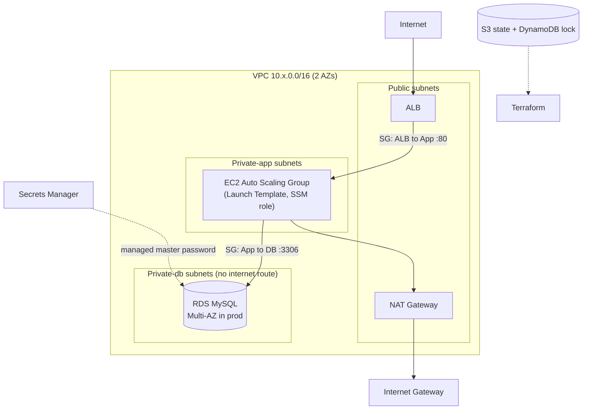
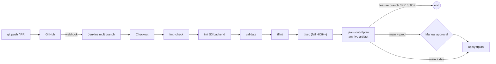

# Production-Style 3-Tier AWS Infrastructure with Terraform + Jenkins

VPC, ALB, EC2 Auto Scaling, RDS MySQL, remote state, reusable modules, and a Jenkins CI/CD pipeline. Everything is Terraform. No SSH keys, no hardcoded passwords.

## Architecture



## CI/CD flow



## Layout

```
bootstrap/          S3 bucket + DynamoDB lock table (local state, run once)
modules/            vpc, security-groups, iam, alb, compute, rds
environments/dev    thin wrapper calling modules + dev.tfvars
environments/prod   same code + prod.tfvars (separate state key)
jenkins-server/     Terraform for the Jenkins EC2 (t3.small, SSM, IAM profile)
jenkins-shared-library/  optional reusable pipeline step
scripts/init.sh|ps1 backend init without hardcoded bucket names
Jenkinsfile         declarative pipeline
docs/GUIDE.md       phase-by-phase walkthrough, verification, common errors
docs/INTERVIEW_PREP.md   30 Q&A, resume bullets, 2-minute script, improvements
```

## Prerequisites

AWS account with MFA on root and a $5 budget alert. IAM user with CLI keys (learning only). AWS CLI v2, Terraform 1.6+, Git. On Windows use Git Bash or WSL, or the `.ps1` script.

```bash
aws configure
aws sts get-caller-identity
```

## Quick start

```bash
# 0. Format once (the pipeline's fmt -check will fail otherwise)
terraform fmt -recursive

# 1. Remote state
cd bootstrap && terraform init && terraform apply && cd ..

# 2. Dev environment
bash scripts/init.sh dev
terraform -chdir=environments/dev plan  -var-file=dev.tfvars
terraform -chdir=environments/dev apply -var-file=dev.tfvars
# open the alb_dns_name output in a browser (wait ~3 min for health checks)

# 3. Destroy when done
terraform -chdir=environments/dev destroy -var-file=dev.tfvars
```

Full walkthrough, including Jenkins setup, is in `docs/GUIDE.md`.

## Cost notes (us-east-1, approximate)

| Item | Cost |
|---|---|
| NAT Gateway | about $0.045/hr, not Free Tier |
| ALB | about $0.0225/hr, mostly not Free Tier |
| RDS db.t3.micro single-AZ | Free Tier (750 hr/mo) on eligible accounts |
| EC2 t3.micro / t3.small | Free Tier covers t3.micro (eligible accounts) |
| Prod (2 NAT, Multi-AZ RDS) | about $0.25 or more per hour, only deploy briefly |

Dev costs roughly $0.08 to $0.10 per hour while running. **Always destroy and stop Jenkins.**

## Destroy instructions

1. `terraform -chdir=environments/dev destroy -var-file=dev.tfvars`
2. Prod has `db_deletion_protection = true`. Set it to `false`, apply, then destroy.
3. Jenkins: `terraform -chdir=jenkins-server destroy -var my_ip_cidr=x.x.x.x/32` (or just stop the instance in the console).
4. Last of all: `cd bootstrap && terraform destroy -var force_destroy=true` (the bucket is versioned and needs force_destroy to be emptied).
